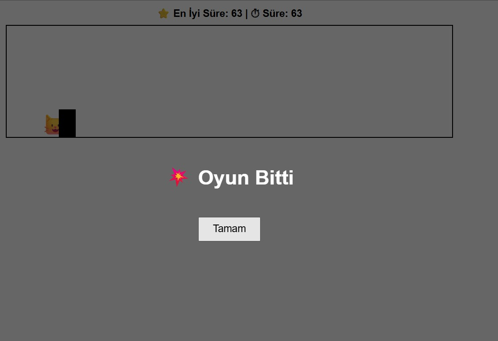

# 🐱 Cat Run – Endless Runner Game

Basit ama eğlenceli bir **endless runner** oyunudur.  
Chrome Dino oyunundan ilham alınarak geliştirilmiştir.

---

## 🎮 Oyun Hakkında

- Oyuncu bir kediyi kontrol eder 🐱
- Karşıdan gelen engellerden zıplayarak kaçılır
- Oyun ilerledikçe **engel hızı artar**
- Çarpışma olursa oyun biter
- En iyi süre ⭐ kalıcı olarak saklanır

---

## 🕹️ Kontroller

### 💻 Bilgisayar
- **Herhangi bir tuş** → Başlat / Zıpla

### 📱 Mobil
- **Ekrana dokun** → Başlat / Zıpla

---

## 🧰 Kullanılan Teknolojiler

- **HTML5**
- **CSS3**
- **Vanilla JavaScript**
- **LocalStorage** (en iyi skor saklama)
- **GitHub Pages** (yayınlama)

---

## ✨ Özellikler

- Klavye + mobil uyumlu
- Yumuşak yerçekimi fiziği
- Zaman bazlı skor sistemi
- En iyi skorun yıldızlı gösterimi ⭐
- Oyun bitti ekranı
- Basit ve okunabilir kod yapısı

---

## 🚀 Canlı Demo

👉 https://mustafabite.github.io/Cat-Run/

---

## 📌 Geliştirici

**Mustafa Bite**  
Yazılım Mühendisliği Öğrencisi  

> Bu proje öğrenme amaçlı geliştirilmiştir.
